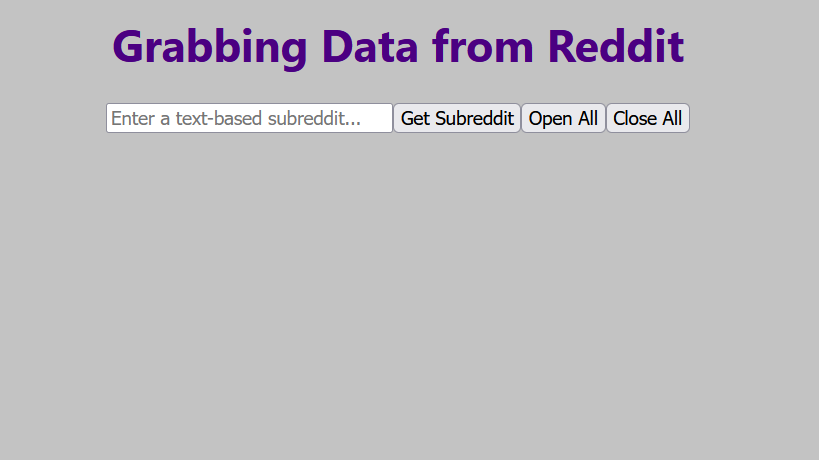
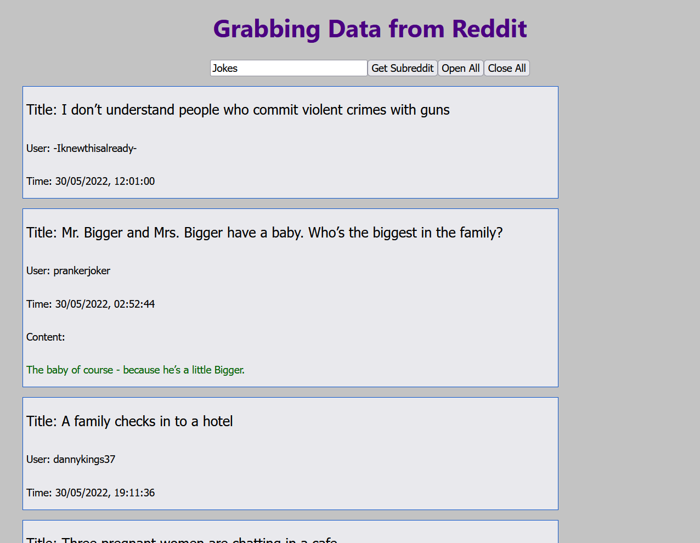

# React/Reddit Project

This is a personal project aimed I worked on to learn [React](https://reactjs.org/) and gain experience with interacting and displaying online data.

Intro Page
 

/r/Jokes subreddit with the second post clicked on to show its content.
 
